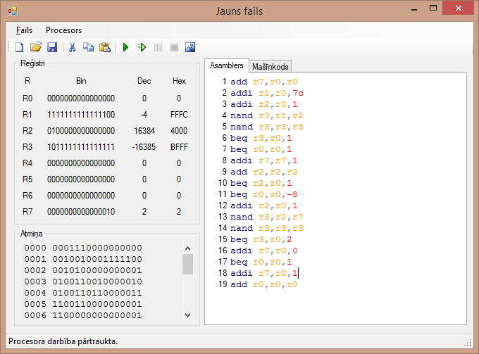

# RISC16 Emulator and Editor

Written in 2009 for the Computer Systems course.

## Csharp

**Features**

* Step by step execution
* Syntax highlighting
* My own programming language (PSharp :D)
* Interface language is Latvian

## JavaScript

Editor was never finished but it works somewhat.

CPU emulation is complete.

## License

Apache 2.0
